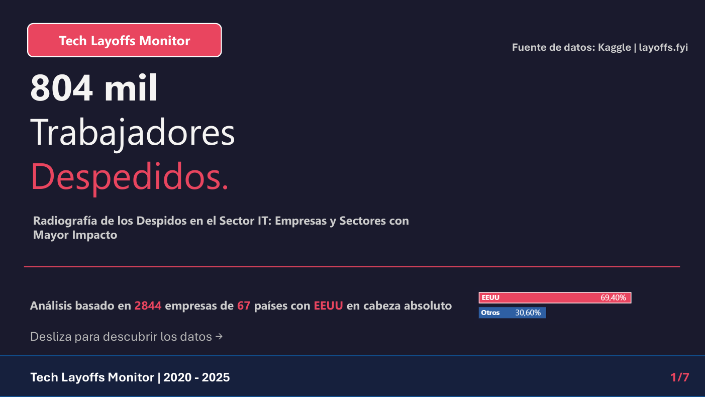
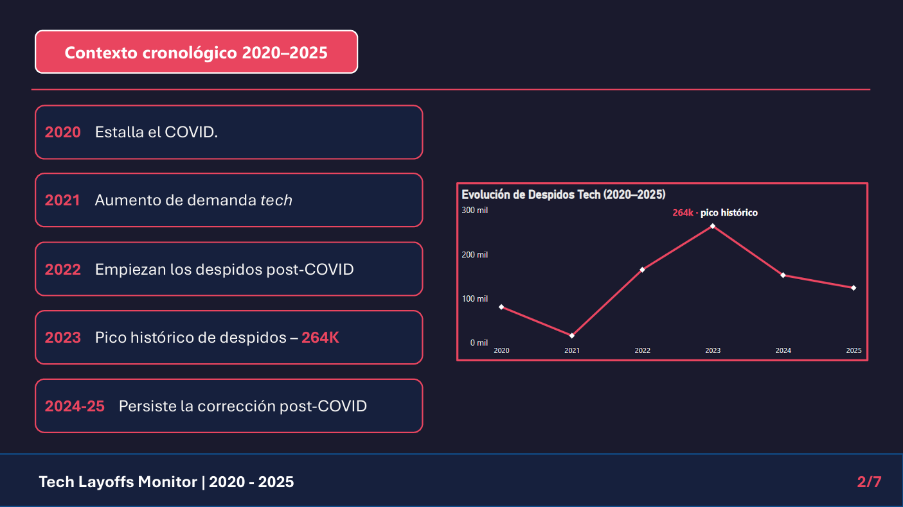
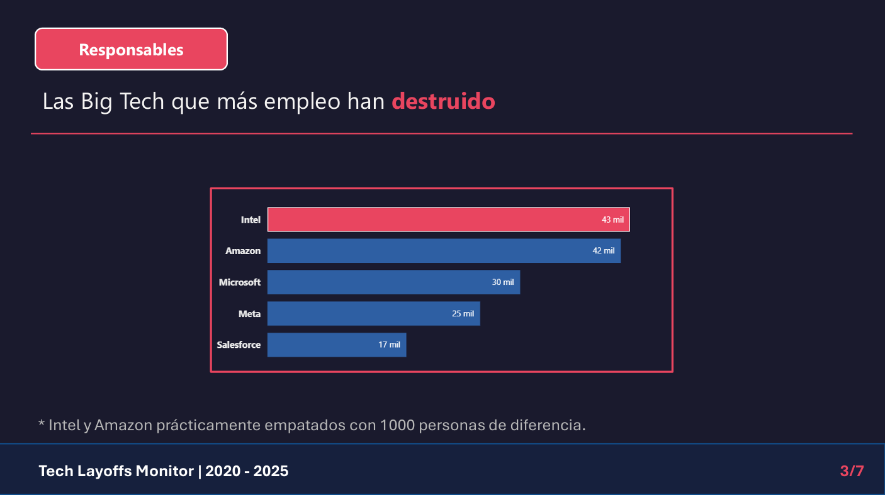
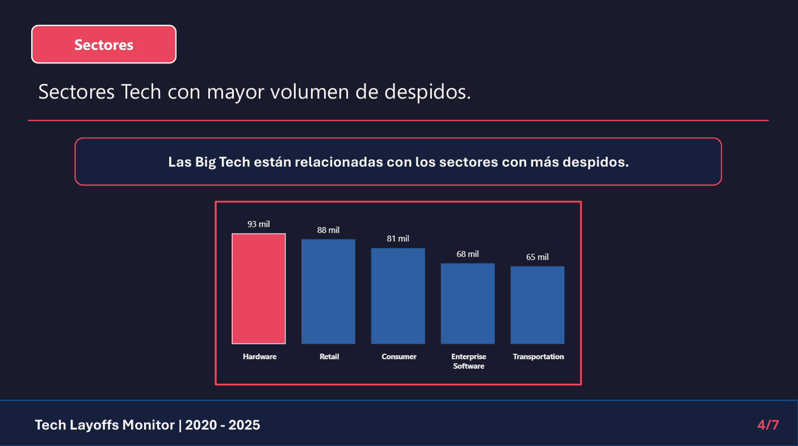
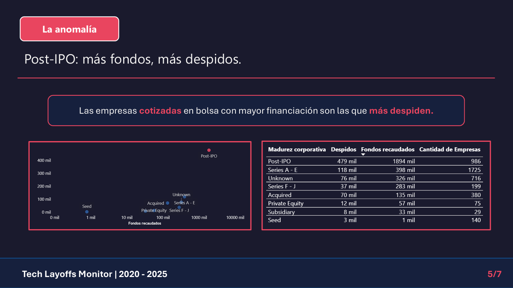
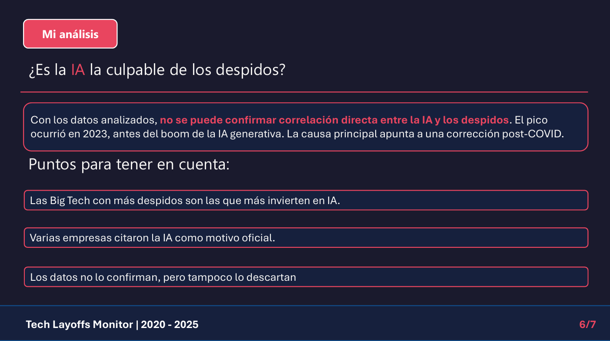

# 📉 Tech Layoffs Monitor (2020-2025)

## 📖 Data Storytelling
*Desliza para ver los puntos clave del análisis o consulta el [Carrusel Completo](carrusel_linkedin_tech_layoffs.pdf)*

  
   

  
  

  
  

## 🎯 Project Overview
Este dashboard analiza el impacto real de los despidos en el sector tecnológico global.

## 🚀 Key Insights
- **Pico Histórico:** 2023 registró el mayor volumen de despidos (264k), estabilizándose en 2024 y 2025.
- **Sectores Críticos:** El hardware (liderado por Intel) y el sector Retail (Amazon) concentran el mayor impacto acumulado.
- **Relación con Fondos:** Existe una correlación directa entre el tipo de financiación (Post-IPO) y el volumen de reestructuración de plantilla.

## 🛠️ Stack Tecnológico
- **Herramienta de BI:** Power BI Desktop.
- **Fuente de Datos:** Layoffs.fyi (actualizado a 2025).

## 📂 Contenido del Repositorio
- `tech-layoffs.pbix`: Archivo fuente con el modelo de datos.
- `Dashboard_Tech_Layoffs_Monitor.png`: Captura de pantalla del diseño final del dashboard.
- `carrusel_linkedin_tech_layoffs.pdf`: Storytelling del dashboard.
---
### 💼 Contacto.
- **Linkedin:** Juan Luis España Ramírez.
- **Email:** juanluis.analytics@outlook.es
